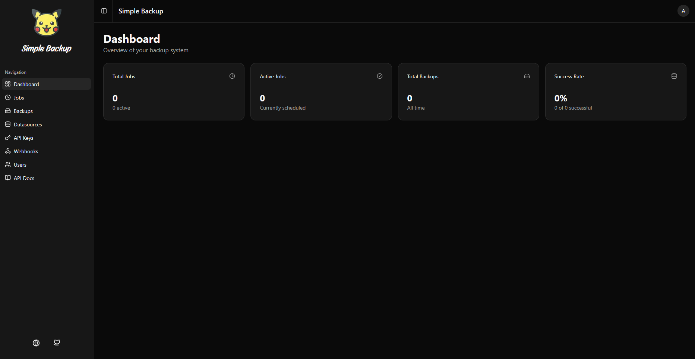

# Simple Backup

<div align="center">
  
</div>

A modern, web-based database backup management system built with Next.js 14+, TypeScript, and Prisma. Simple Backup allows you to configure database connections, schedule automated backups, manage backup files, and integrate with external systems via API keys and webhooks.


## ✨ Features

### 🗄️ Database Support

- **MySQL** - Full support for MySQL/MariaDB databases
- **PostgreSQL** - Complete PostgreSQL backup capabilities
- **MongoDB** - MongoDB database backup support

### ⚙️ Core Functionality

- **Multiple Datasources** - Manage multiple database connections
- **Automated Scheduling** - Cron-based job scheduling for regular backups
- **Manual Triggers** - Run backups on-demand via UI or API
- **Backup Management** - View, download, and manage backup files
- **Connection Testing** - Test database connections before creating jobs

### 🔐 Security

- **User Authentication** - JWT-based authentication with HTTP-only cookies
- **Password Encryption** - AES-256-GCM encryption for database passwords
- **API Key Management** - Generate and manage API keys for programmatic access
- **Role-Based Access** - Admin and User roles

### 🔔 Integrations

- **Webhooks** - Configure webhooks for job success/failure events
- **REST API** - Complete REST API for all operations
- **API Documentation** - Built-in API documentation page

### 🎨 User Interface

- **Modern UI** - Built with Shadcn/UI and Tailwind CSS
- **Dark/Light Mode** - Theme support
- **Responsive Design** - Works on desktop and mobile devices
- **Real-time Updates** - Live status updates for jobs and backups

### 🐳 Deployment

- **Docker Support** - Ready-to-use Dockerfile and docker-compose.yml
- **Docker Secrets** - Secure secret management with Docker secrets
- **Production Ready** - Optimized for production deployments

## 🚀 Quick Start

### Prerequisites

- Node.js 20+ or Bun
- Database client tools installed:

  - MySQL: `mysql` and `mysqldump`
  - PostgreSQL: `psql` and `pg_dump`
  - MongoDB: `mongosh` and `mongodump`

### Installation

1. **Clone the repository**

   ```bash
   git clone https://github.com/yourusername/simple-backup.git
   cd simple-backup
   ```

2. **Install dependencies**

   ```bash
   bun install
   # or
   npm install
   ```

3. **Set up environment variables**

   ```bash
   cp .env.example .env
   ```

   Edit `.env` and set:

   ```env
   DATABASE_URL="file:./prisma/system.db"
   JWT_SECRET="your-super-secret-jwt-key-min-32-chars"
   ENCRYPTION_KEY="your-super-secret-encryption-key-32-chars"
   BACKUP_BASE_PATH="./backups"
   ```

4. **Initialize the database**

   ```bash
   bun run prisma:generate
   bun run prisma:migrate
   bun run prisma:seed
   ```

5. **Start the development server**

   ```bash
   bun run dev
   ```

6. **Access the application**

   - Open <http://localhost:3001>
   - Login with default credentials: `admin` / `admin`
   - **Important**: Change the default password after first login!

## 🐳 Docker Deployment

### Quick Start with Docker

1. **Create secret files**

   ```bash
   mkdir -p secrets
   echo "file:/data/system.db" > secrets/DATABASE_URL
   echo "your-jwt-secret" > secrets/JWT_SECRET
   echo "your-encryption-key" > secrets/ENCRYPTION_KEY
   echo "./backups" > secrets/BACKUP_BASE_PATH
   ```

2. **Start with Docker Compose**

   ```bash
   docker-compose up -d
   ```

3. **Access the application**

   - Open <http://localhost:3000>
   - Login with default credentials: `admin` / `admin`

For detailed Docker setup instructions, see [README.docker.md](./README.docker.md).

## 📖 Usage Guide

<div align="center">
  
  <p><em>Simple Backup Dashboard</em></p>
</div>

### Creating a Datasource

1. Navigate to **Datasources** in the sidebar

2. Click **Create Datasource**
3. Fill in the connection details:
   - Name: A friendly name for this connection
   - Database Type: MySQL, PostgreSQL, or MongoDB
   - Host: Database server hostname or IP
   - Port: Database server port (defaults provided)
   - Username: Database username
   - Password: Database password
   - Database Name: Target database name
4. Click **Test Connection** to verify the connection
5. Click **Create** to save

### Creating a Backup Job

1. Navigate to **Jobs** in the sidebar

2. Click **Create Job**
3. Configure the job:
   - Title: A descriptive name for the job
   - Datasource: Select a configured datasource
   - Cron Expression: Schedule using cron syntax (helper available)
   - Destination Path: Where to save backups
   - Active: Enable/disable the job
4. Click **Create** to save

### Running a Backup Manually

1. Go to **Jobs** page

2. Find the job you want to run
3. Click the **Run** button (play icon)
4. Monitor the status in the **Backups** page

### Managing Backups

1. Navigate to **Backups** in the sidebar

2. View all backup files with their status
3. Download backups using the download button
4. Delete old backups as needed

### API Access

1. Navigate to **API Keys** in the sidebar

2. Click **Create API Key**
3. Copy the generated API key (shown only once!)
4. Use the API key in the `X-API-Key` header for API requests

See the built-in **API Docs** page for complete API documentation.

## 🔌 API Documentation

The application includes a comprehensive API documentation page accessible at `/api-docs` when logged in.

### Authentication

#### Session-based (Web UI)
- Login via `/api/auth/login` with username and password
- Session stored in HTTP-only cookie

#### API Key-based
- Include `X-API-Key` header in API requests
- API keys can be created in the UI

### Example API Usage

```bash
# Create a datasource
curl -X POST http://localhost:3001/api/datasources \
  -H "X-API-Key: your-api-key" \
  -H "Content-Type: application/json" \
  -d '{
    "name": "Production DB",
    "type": "MYSQL",
    "host": "localhost",
    "port": 3306,
    "username": "root",
    "password": "password",
    "databaseName": "mydb"
  }'

# Trigger a backup job
curl -X POST http://localhost:3001/api/trigger/job-id \
  -H "X-API-Key: your-api-key"

# List backups
curl http://localhost:3001/api/backups \
  -H "X-API-Key: your-api-key"
```

## 🏗️ Architecture

### Tech Stack

- **Framework**: Next.js 14+ (App Router)
- **Language**: TypeScript
- **Database**: SQLite (via Prisma)
- **ORM**: Prisma
- **Styling**: Tailwind CSS
- **UI Components**: Shadcn/UI
- **Authentication**: JWT (jose) + Argon2
- **Scheduling**: node-schedule
- **Validation**: Zod

### Project Structure

```text
simple-backup/
├── app/                    # Next.js app directory
│   ├── (dashboard)/        # Dashboard routes
│   ├── api/                # API routes
│   ├── login/              # Login page
│   └── layout.tsx          # Root layout
├── components/             # React components
│   ├── ui/                 # Shadcn/UI components
│   └── ...                 # Feature components
├── lib/                    # Utility libraries
│   ├── auth.ts             # Authentication
│   ├── backup-service.ts   # Backup execution
│   ├── scheduler.ts        # Job scheduling
│   ├── database-commands.ts # DB command builders
│   └── ...                 # Other utilities
├── prisma/                 # Prisma schema and migrations
├── public/                 # Static assets
└── secrets/                # Docker secrets (gitignored)
```

### Key Components

- **Backup Service**: Executes database backups using native tools

- **Scheduler**: Manages cron job scheduling
- **API Routes**: RESTful API endpoints
- **Middleware**: Authentication and authorization
- **UI Components**: Reusable React components

## 🔒 Security

### Password Storage

- Database passwords are encrypted using AES-256-GCM

- Each encryption uses a unique salt
- Encryption key stored securely (use Docker secrets in production)

### Authentication

- JWT tokens with 7-day expiration

- HTTP-only cookies for web sessions
- API keys with prefix-based validation

### Best Practices

- Always use strong secrets in production

- Rotate API keys regularly
- Use HTTPS in production
- Keep database client tools updated

## 🧪 Development

### Available Scripts

```bash
# Development
bun run dev          # Start development server (port 3001)

# Production
bun run build        # Build for production
bun run start        # Start production server

# Database
bun run prisma:generate   # Generate Prisma Client
bun run prisma:migrate    # Run migrations
bun run prisma:seed      # Seed database

# Linting
bun run lint         # Run ESLint
```

### Environment Variables

| Variable | Description | Default |
|----------|-------------|---------|
| `DATABASE_URL` | SQLite database path | `file:./prisma/system.db` |
| `JWT_SECRET` | JWT signing secret | (required in production) |
| `ENCRYPTION_KEY` | Encryption key for passwords | (required in production) |
| `BACKUP_BASE_PATH` | Base path for backup files | `./backups` |
| `NEXT_PUBLIC_APP_URL` | Public app URL | `http://localhost:3000` |

## 📝 License

This project is licensed under the MIT License - see the [LICENSE](./LICENSE) file for details.

## 🤝 Contributing

Contributions are welcome! Please feel free to submit a Pull Request.

1. Fork the repository
2. Create your feature branch (`git checkout -b feature/AmazingFeature`)
3. Commit your changes (`git commit -m 'Add some AmazingFeature'`)
4. Push to the branch (`git push origin feature/AmazingFeature`)
5. Open a Pull Request

## 🐛 Issues

If you encounter any issues or have feature requests, please open an issue on GitHub.

## 🙏 Acknowledgments

- Built with [Next.js](https://nextjs.org/)
- UI components from [Shadcn/UI](https://ui.shadcn.com/)
- Icons from [Lucide](https://lucide.dev/)
- Database ORM by [Prisma](https://www.prisma.io/)

## 📧 Support

For support, please open an issue on GitHub or contact the maintainers.

---

**Note**: This is a self-hosted solution. Make sure to:
- Use strong secrets in production
- Set up proper backups for the application database
- Configure firewall rules appropriately
- Keep all dependencies updated
- Monitor disk space for backup storage
